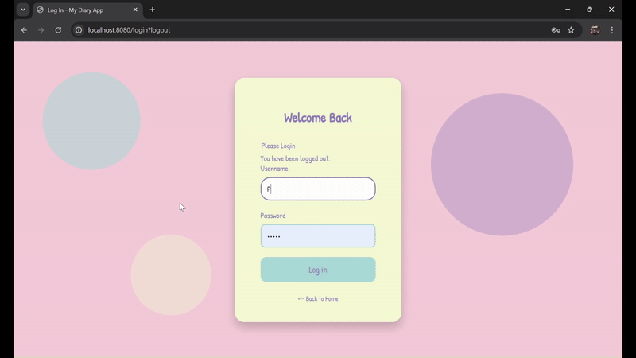

# MyDiary

## 📝 Overview

  This is a simple Diary Entry web application where users can write and     save their personal diary entries.
All entries are stored securely in a database for future viewing and     management.

# ✨ Features

Write diary entries with title and description.

Save entries into a connected database.

View and manage past diary entries.

Clean and user-friendly interface.

## 🛠️ Technologies Used

Frontend: HTML /CSS /JavaScript

Backend: Java /Spring Boot

Database:  MongoDB Atlas

## 📸 Demo

Screenshots

The login page

Your diary 

Your Recent Diaries

View Your Diary

## DEMO VIDEO FOR YOU

A demo video for you

## 🌐 Live Project

You can try the live version of the Diary Entry app here:  
👉 [Click here to redirect to our website](https://diaryentry-3.onrender.com)

⚡ **Note:** The site may take a few seconds to load because it is hosted on a free Render server, which puts apps to sleep when inactive.

## 🌟 Future Improvements

Edit and delete existing user accounts.

Search diary entries by date or keyword.

Edit option for existing diary.

Adding javascript file for a better notification.

Add themes and customization options for writing.

